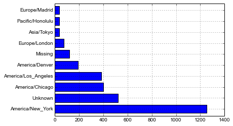
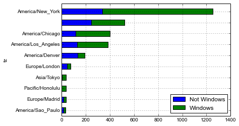
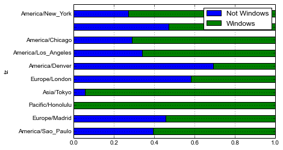
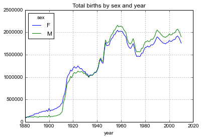
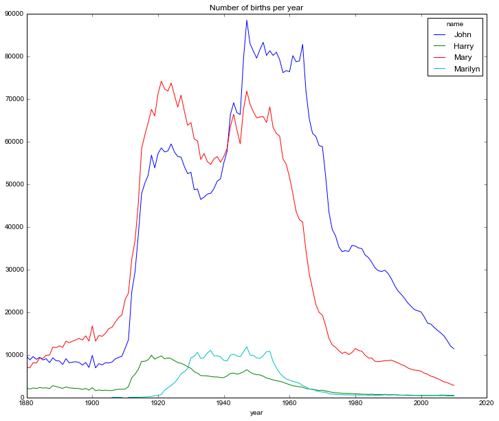
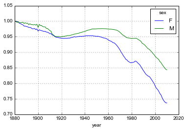
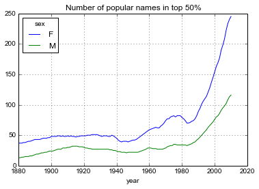
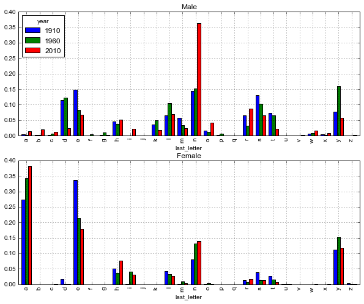

# Python for Data Analysis - Chapter 2

Module imports go here

    import numpy as np
    import pandas as pd
    %matplotlib inline

# usa.gov data from bit.ly

    path = 'usagov_bitly_data2012-03-16-1331923249.txt'
    open(path).readline()

    '{ "a": "Mozilla\\/5.0 (Windows NT 6.1; WOW64) AppleWebKit\\/535.11 (KHTML, like Gecko) Chrome\\/17.0.963.78 Safari\\/535.11", "c": "US", "nk": 1, "tz": "America\\/New_York", "gr": "MA", "g": "A6qOVH", "h": "wfLQtf", "l": "orofrog", "al": "en-US,en;q=0.8", "hh": "1.usa.gov", "r": "http:\\/\\/www.facebook.com\\/l\\/7AQEFzjSi\\/1.usa.gov\\/wfLQtf", "u": "http:\\/\\/www.ncbi.nlm.nih.gov\\/pubmed\\/22415991", "t": 1331923247, "hc": 1331822918, "cy": "Danvers", "ll": [ 42.576698, -70.954903 ] }\n'

Each line of the data is in JSON format. We can use `json` module to read json
string to python dictionary.

    import json
    records = [json.loads(line) for line in open(path)]
    records[0]

    {u'a': u'Mozilla/5.0 (Windows NT 6.1; WOW64) AppleWebKit/535.11 (KHTML, like Gecko) Chrome/17.0.963.78 Safari/535.11',
     u'al': u'en-US,en;q=0.8',
     u'c': u'US',
     u'cy': u'Danvers',
     u'g': u'A6qOVH',
     u'gr': u'MA',
     u'h': u'wfLQtf',
     u'hc': 1331822918,
     u'hh': u'1.usa.gov',
     u'l': u'orofrog',
     u'll': [42.576698, -70.954903],
     u'nk': 1,
     u'r': u'http://www.facebook.com/l/7AQEFzjSi/1.usa.gov/wfLQtf',
     u't': 1331923247,
     u'tz': u'America/New_York',
     u'u': u'http://www.ncbi.nlm.nih.gov/pubmed/22415991'}

# Counting time zones in pure python

It seems that not all records have time zone field.

    time_zones = [rec['tz'] for rec in records]

    ---------------------------------------------------------------------------
    KeyError                                  Traceback (most recent call last)

    <ipython-input-4-db4fbd348da9> in <module>()
    ----> 1 time_zones = [rec['tz'] for rec in records]
    

    KeyError: 'tz'

    # Let's access time zone field only if it exists
    time_zones = [rec['tz'] for rec in records if 'tz' in rec]
    time_zones[:10]

    [u'America/New_York',
     u'America/Denver',
     u'America/New_York',
     u'America/Sao_Paulo',
     u'America/New_York',
     u'America/New_York',
     u'Europe/Warsaw',
     u'',
     u'',
     u'']

    # Let's count time zones
    from collections import defaultdict
    def get_counts(sequence):
        counts = defaultdict(int)   # values will init to 0
        for x in sequence:
            counts[x] += 1
        return counts
    
    counts = get_counts(time_zones)
    counts['America/New_York']

    1251

    len(time_zones)

    3440

# Counting time zones with pandas

Let's create a `DataFrame` object from the original set of records.

    from pandas import DataFrame, Series
    import pandas as pd

    frame = DataFrame(records)
    frame.head()

<table border="1" class="dataframe">
  <thead>
    <tr style="text-align: right;">
      <th></th>
      <th>_heartbeat_</th>
      <th>a</th>
      <th>al</th>
      <th>c</th>
      <th>cy</th>
      <th>g</th>
      <th>gr</th>
      <th>h</th>
      <th>hc</th>
      <th>hh</th>
      <th>kw</th>
      <th>l</th>
      <th>ll</th>
      <th>nk</th>
      <th>r</th>
      <th>t</th>
      <th>tz</th>
      <th>u</th>
    </tr>
  </thead>
  <tbody>
    <tr>
      <th>0</th>
      <td>NaN</td>
      <td> Mozilla/5.0 (Windows NT 6.1; WOW64) AppleWebKi...</td>
      <td> en-US,en;q=0.8</td>
      <td> US</td>
      <td>    Danvers</td>
      <td> A6qOVH</td>
      <td> MA</td>
      <td> wfLQtf</td>
      <td> 1331822918</td>
      <td> 1.usa.gov</td>
      <td> NaN</td>
      <td>  orofrog</td>
      <td>  [42.576698, -70.954903]</td>
      <td> 1</td>
      <td> http://www.facebook.com/l/7AQEFzjSi/1.usa.gov/...</td>
      <td> 1331923247</td>
      <td>  America/New_York</td>
      <td>       http://www.ncbi.nlm.nih.gov/pubmed/22415991</td>
    </tr>
    <tr>
      <th>1</th>
      <td>NaN</td>
      <td>                            GoogleMaps/RochesterNY</td>
      <td>            NaN</td>
      <td> US</td>
      <td>      Provo</td>
      <td> mwszkS</td>
      <td> UT</td>
      <td> mwszkS</td>
      <td> 1308262393</td>
      <td>      j.mp</td>
      <td> NaN</td>
      <td>    bitly</td>
      <td> [40.218102, -111.613297]</td>
      <td> 0</td>
      <td>                          http://www.AwareMap.com/</td>
      <td> 1331923249</td>
      <td>    America/Denver</td>
      <td>       http://www.monroecounty.gov/etc/911/rss.php</td>
    </tr>
    <tr>
      <th>2</th>
      <td>NaN</td>
      <td> Mozilla/4.0 (compatible; MSIE 8.0; Windows NT ...</td>
      <td>          en-US</td>
      <td> US</td>
      <td> Washington</td>
      <td> xxr3Qb</td>
      <td> DC</td>
      <td> xxr3Qb</td>
      <td> 1331919941</td>
      <td> 1.usa.gov</td>
      <td> NaN</td>
      <td>    bitly</td>
      <td>    [38.9007, -77.043098]</td>
      <td> 1</td>
      <td>                              http://t.co/03elZC4Q</td>
      <td> 1331923250</td>
      <td>  America/New_York</td>
      <td> http://boxer.senate.gov/en/press/releases/0316...</td>
    </tr>
    <tr>
      <th>3</th>
      <td>NaN</td>
      <td> Mozilla/5.0 (Macintosh; Intel Mac OS X 10_6_8)...</td>
      <td>          pt-br</td>
      <td> BR</td>
      <td>       Braz</td>
      <td> zCaLwp</td>
      <td> 27</td>
      <td> zUtuOu</td>
      <td> 1331923068</td>
      <td> 1.usa.gov</td>
      <td> NaN</td>
      <td> alelex88</td>
      <td> [-23.549999, -46.616699]</td>
      <td> 0</td>
      <td>                                            direct</td>
      <td> 1331923249</td>
      <td> America/Sao_Paulo</td>
      <td>           http://apod.nasa.gov/apod/ap120312.html</td>
    </tr>
    <tr>
      <th>4</th>
      <td>NaN</td>
      <td> Mozilla/5.0 (Windows NT 6.1; WOW64) AppleWebKi...</td>
      <td> en-US,en;q=0.8</td>
      <td> US</td>
      <td> Shrewsbury</td>
      <td> 9b6kNl</td>
      <td> MA</td>
      <td> 9b6kNl</td>
      <td> 1273672411</td>
      <td>    bit.ly</td>
      <td> NaN</td>
      <td>    bitly</td>
      <td>  [42.286499, -71.714699]</td>
      <td> 0</td>
      <td>               http://www.shrewsbury-ma.gov/selco/</td>
      <td> 1331923251</td>
      <td>  America/New_York</td>
      <td> http://www.shrewsbury-ma.gov/egov/gallery/1341...</td>
    </tr>
  </tbody>
</table>

5 rows × 18 columns

The `Series` object `frame['tz']` has a method `value_counts` for what we want

    tz_counts = frame['tz'].value_counts()
    tz_counts[:10]

    America/New_York       1251
                            521
    America/Chicago         400
    America/Los_Angeles     382
    America/Denver          191
    Europe/London            74
    Asia/Tokyo               37
    Pacific/Honolulu         36
    Europe/Madrid            35
    America/Sao_Paulo        33
    dtype: int64

Some data munging

    clean_tz = frame['tz'].fillna('Missing')
    clean_tz[clean_tz == ''] = 'Unknown'
    tz_counts = clean_tz.value_counts()
    tz_counts[:10]

    America/New_York       1251
    Unknown                 521
    America/Chicago         400
    America/Los_Angeles     382
    America/Denver          191
    Missing                 120
    Europe/London            74
    Asia/Tokyo               37
    Pacific/Honolulu         36
    Europe/Madrid            35
    dtype: int64

Let's make a horizontal plot on the counts

    tz_counts[:10].plot(kind='barh', rot=0)

    <matplotlib.axes.AxesSubplot at 0x7fd68022b850>

The `a` field of the data frame contains information about the browser, device
and application.

    frame['a'][1]

    u'GoogleMaps/RochesterNY'

    frame['a'][50]

    u'Mozilla/5.0 (Windows NT 5.1; rv:10.0.2) Gecko/20100101 Firefox/10.0.2'

We're only interested in the browser name, roughly the first token of the string

    results = Series([x.split()[0] for x in frame.a.dropna()])
    results[:5]

    0               Mozilla/5.0
    1    GoogleMaps/RochesterNY
    2               Mozilla/4.0
    3               Mozilla/5.0
    4               Mozilla/5.0
    dtype: object

Suppose we want to decompose top time zones into Windows and non-Windows
users. Let's start with excluding records that are missing agent information.

    cframe = frame[frame.a.notnull()]

And for each record, find if it is Windows or not.

    operating_system = np.where(cframe['a'].str.contains('Windows'), 'Windows', 'Not Windows')
    operating_system[:5]

    array(['Windows', 'Not Windows', 'Windows', 'Not Windows', 'Windows'], 
          dtype='|S11')

Then, we can group the data by its time zone column and the operating system.

    

    by_tz_os = cframe.groupby(['tz', operating_system])
    agg_counts = by_tz_os.size().unstack().fillna(0)
    agg_counts[:10]

<table border="1" class="dataframe">
  <thead>
    <tr style="text-align: right;">
      <th></th>
      <th>Not Windows</th>
      <th>Windows</th>
    </tr>
    <tr>
      <th>tz</th>
      <th></th>
      <th></th>
    </tr>
  </thead>
  <tbody>
    <tr>
      <th></th>
      <td> 245</td>
      <td> 276</td>
    </tr>
    <tr>
      <th>Africa/Cairo</th>
      <td>   0</td>
      <td>   3</td>
    </tr>
    <tr>
      <th>Africa/Casablanca</th>
      <td>   0</td>
      <td>   1</td>
    </tr>
    <tr>
      <th>Africa/Ceuta</th>
      <td>   0</td>
      <td>   2</td>
    </tr>
    <tr>
      <th>Africa/Johannesburg</th>
      <td>   0</td>
      <td>   1</td>
    </tr>
    <tr>
      <th>Africa/Lusaka</th>
      <td>   0</td>
      <td>   1</td>
    </tr>
    <tr>
      <th>America/Anchorage</th>
      <td>   4</td>
      <td>   1</td>
    </tr>
    <tr>
      <th>America/Argentina/Buenos_Aires</th>
      <td>   1</td>
      <td>   0</td>
    </tr>
    <tr>
      <th>America/Argentina/Cordoba</th>
      <td>   0</td>
      <td>   1</td>
    </tr>
    <tr>
      <th>America/Argentina/Mendoza</th>
      <td>   0</td>
      <td>   1</td>
    </tr>
  </tbody>
</table>

10 rows × 2 columns

Let's select the top overall time zones.

    indexer = agg_counts.sum(1).argsort()
    indexer

    tz
                                      24
    Africa/Cairo                      20
    Africa/Casablanca                 21
    Africa/Ceuta                      92
    Africa/Johannesburg               87
    Africa/Lusaka                     53
    America/Anchorage                 54
    America/Argentina/Buenos_Aires    57
    America/Argentina/Cordoba         26
    America/Argentina/Mendoza         55
    America/Bogota                    62
    America/Caracas                   34
    America/Chicago                   60
    America/Chihuahua                 36
    America/Costa_Rica                37
    ...
    Europe/Paris        19
    Europe/Prague       64
    Europe/Riga         32
    Europe/Rome         85
    Europe/Skopje       67
    Europe/Sofia        35
    Europe/Stockholm    78
    Europe/Uzhgorod     96
    Europe/Vienna       59
    Europe/Vilnius      77
    Europe/Volgograd    15
    Europe/Warsaw       22
    Europe/Zurich       12
    Pacific/Auckland     0
    Pacific/Honolulu    29
    Length: 97, dtype: int64

Take the last 10 rows

    count_subset = agg_counts.take(indexer)[-10:]
    count_subset

<table border="1" class="dataframe">
  <thead>
    <tr style="text-align: right;">
      <th></th>
      <th>Not Windows</th>
      <th>Windows</th>
    </tr>
    <tr>
      <th>tz</th>
      <th></th>
      <th></th>
    </tr>
  </thead>
  <tbody>
    <tr>
      <th>America/Sao_Paulo</th>
      <td>  13</td>
      <td>  20</td>
    </tr>
    <tr>
      <th>Europe/Madrid</th>
      <td>  16</td>
      <td>  19</td>
    </tr>
    <tr>
      <th>Pacific/Honolulu</th>
      <td>   0</td>
      <td>  36</td>
    </tr>
    <tr>
      <th>Asia/Tokyo</th>
      <td>   2</td>
      <td>  35</td>
    </tr>
    <tr>
      <th>Europe/London</th>
      <td>  43</td>
      <td>  31</td>
    </tr>
    <tr>
      <th>America/Denver</th>
      <td> 132</td>
      <td>  59</td>
    </tr>
    <tr>
      <th>America/Los_Angeles</th>
      <td> 130</td>
      <td> 252</td>
    </tr>
    <tr>
      <th>America/Chicago</th>
      <td> 115</td>
      <td> 285</td>
    </tr>
    <tr>
      <th></th>
      <td> 245</td>
      <td> 276</td>
    </tr>
    <tr>
      <th>America/New_York</th>
      <td> 339</td>
      <td> 912</td>
    </tr>
  </tbody>
</table>

10 rows × 2 columns

Let's make stacked bar plot of the counts

    count_subset.plot(kind='barh', stacked=True)

    <matplotlib.axes.AxesSubplot at 0x7fd67ffe5190>

What about the relative percentage of Windows users

    normed_subset = count_subset.div(count_subset.sum(1), axis=0)
    normed_subset.plot(kind='barh', stacked=True)

    <matplotlib.axes.AxesSubplot at 0x7fd67ff72110>

# MovieLens 1M Data Set

Collection of movie ratings data collected from users of MovieLens in the late
90s and early 2000s. It's spread across 3 tables: ratings, user information and
movie information.

    import pandas as pd
    unames = ['user_id', 'gender', 'age', 'occupation', 'zip']
    users = pd.read_table('movielens/users.dat', sep='::', header=None,
                          names=unames)
    
    rnames = ['user_id', 'movie_id', 'rating', 'timestamp']
    ratings = pd.read_table('movielens/ratings.dat', sep='::', header=None,
                            names=rnames)
    
    mnames = ['movie_id', 'title', 'genres']
    movies = pd.read_table('movielens/movies.dat', sep='::', header=None,
                           names=mnames)

    users[:5]

<table border="1" class="dataframe">
  <thead>
    <tr style="text-align: right;">
      <th></th>
      <th>user_id</th>
      <th>gender</th>
      <th>age</th>
      <th>occupation</th>
      <th>zip</th>
    </tr>
  </thead>
  <tbody>
    <tr>
      <th>0</th>
      <td> 1</td>
      <td> F</td>
      <td>  1</td>
      <td> 10</td>
      <td> 48067</td>
    </tr>
    <tr>
      <th>1</th>
      <td> 2</td>
      <td> M</td>
      <td> 56</td>
      <td> 16</td>
      <td> 70072</td>
    </tr>
    <tr>
      <th>2</th>
      <td> 3</td>
      <td> M</td>
      <td> 25</td>
      <td> 15</td>
      <td> 55117</td>
    </tr>
    <tr>
      <th>3</th>
      <td> 4</td>
      <td> M</td>
      <td> 45</td>
      <td>  7</td>
      <td> 02460</td>
    </tr>
    <tr>
      <th>4</th>
      <td> 5</td>
      <td> M</td>
      <td> 25</td>
      <td> 20</td>
      <td> 55455</td>
    </tr>
  </tbody>
</table>

5 rows × 5 columns

    movies[:5]

<table border="1" class="dataframe">
  <thead>
    <tr style="text-align: right;">
      <th></th>
      <th>movie_id</th>
      <th>title</th>
      <th>genres</th>
    </tr>
  </thead>
  <tbody>
    <tr>
      <th>0</th>
      <td> 1</td>
      <td>                   Toy Story (1995)</td>
      <td>  Animation|Children's|Comedy</td>
    </tr>
    <tr>
      <th>1</th>
      <td> 2</td>
      <td>                     Jumanji (1995)</td>
      <td> Adventure|Children's|Fantasy</td>
    </tr>
    <tr>
      <th>2</th>
      <td> 3</td>
      <td>            Grumpier Old Men (1995)</td>
      <td>               Comedy|Romance</td>
    </tr>
    <tr>
      <th>3</th>
      <td> 4</td>
      <td>           Waiting to Exhale (1995)</td>
      <td>                 Comedy|Drama</td>
    </tr>
    <tr>
      <th>4</th>
      <td> 5</td>
      <td> Father of the Bride Part II (1995)</td>
      <td>                       Comedy</td>
    </tr>
  </tbody>
</table>

5 rows × 3 columns

    ratings[:5]

<table border="1" class="dataframe">
  <thead>
    <tr style="text-align: right;">
      <th></th>
      <th>user_id</th>
      <th>movie_id</th>
      <th>rating</th>
      <th>timestamp</th>
    </tr>
  </thead>
  <tbody>
    <tr>
      <th>0</th>
      <td> 1</td>
      <td> 1193</td>
      <td> 5</td>
      <td> 978300760</td>
    </tr>
    <tr>
      <th>1</th>
      <td> 1</td>
      <td>  661</td>
      <td> 3</td>
      <td> 978302109</td>
    </tr>
    <tr>
      <th>2</th>
      <td> 1</td>
      <td>  914</td>
      <td> 3</td>
      <td> 978301968</td>
    </tr>
    <tr>
      <th>3</th>
      <td> 1</td>
      <td> 3408</td>
      <td> 4</td>
      <td> 978300275</td>
    </tr>
    <tr>
      <th>4</th>
      <td> 1</td>
      <td> 2355</td>
      <td> 5</td>
      <td> 978824291</td>
    </tr>
  </tbody>
</table>

5 rows × 4 columns

Let's merge all three tables. Pandas' `merge` function merges tables based on
overlapping column names.

    data = pd.merge(pd.merge(ratings, users), movies)
    data[:5]

<table border="1" class="dataframe">
  <thead>
    <tr style="text-align: right;">
      <th></th>
      <th>user_id</th>
      <th>movie_id</th>
      <th>rating</th>
      <th>timestamp</th>
      <th>gender</th>
      <th>age</th>
      <th>occupation</th>
      <th>zip</th>
      <th>title</th>
      <th>genres</th>
    </tr>
  </thead>
  <tbody>
    <tr>
      <th>0</th>
      <td>  1</td>
      <td> 1193</td>
      <td> 5</td>
      <td> 978300760</td>
      <td> F</td>
      <td>  1</td>
      <td> 10</td>
      <td> 48067</td>
      <td> One Flew Over the Cuckoo's Nest (1975)</td>
      <td> Drama</td>
    </tr>
    <tr>
      <th>1</th>
      <td>  2</td>
      <td> 1193</td>
      <td> 5</td>
      <td> 978298413</td>
      <td> M</td>
      <td> 56</td>
      <td> 16</td>
      <td> 70072</td>
      <td> One Flew Over the Cuckoo's Nest (1975)</td>
      <td> Drama</td>
    </tr>
    <tr>
      <th>2</th>
      <td> 12</td>
      <td> 1193</td>
      <td> 4</td>
      <td> 978220179</td>
      <td> M</td>
      <td> 25</td>
      <td> 12</td>
      <td> 32793</td>
      <td> One Flew Over the Cuckoo's Nest (1975)</td>
      <td> Drama</td>
    </tr>
    <tr>
      <th>3</th>
      <td> 15</td>
      <td> 1193</td>
      <td> 4</td>
      <td> 978199279</td>
      <td> M</td>
      <td> 25</td>
      <td>  7</td>
      <td> 22903</td>
      <td> One Flew Over the Cuckoo's Nest (1975)</td>
      <td> Drama</td>
    </tr>
    <tr>
      <th>4</th>
      <td> 17</td>
      <td> 1193</td>
      <td> 5</td>
      <td> 978158471</td>
      <td> M</td>
      <td> 50</td>
      <td>  1</td>
      <td> 95350</td>
      <td> One Flew Over the Cuckoo's Nest (1975)</td>
      <td> Drama</td>
    </tr>
  </tbody>
</table>

5 rows × 10 columns

    data.ix[0]

    user_id                                            1
    movie_id                                        1193
    rating                                             5
    timestamp                                  978300760
    gender                                             F
    age                                                1
    occupation                                        10
    zip                                            48067
    title         One Flew Over the Cuckoo's Nest (1975)
    genres                                         Drama
    Name: 0, dtype: object

To get mean movie ratings for each film grouped by gender, we can use Pandas'
`pivot_table` function

    mean_ratings = data.pivot_table('rating', rows='title', cols='gender',
                                    aggfunc='mean')
    mean_ratings[:5]

<table border="1" class="dataframe">
  <thead>
    <tr style="text-align: right;">
      <th>gender</th>
      <th>F</th>
      <th>M</th>
    </tr>
    <tr>
      <th>title</th>
      <th></th>
      <th></th>
    </tr>
  </thead>
  <tbody>
    <tr>
      <th>$1,000,000 Duck (1971)</th>
      <td> 3.375000</td>
      <td> 2.761905</td>
    </tr>
    <tr>
      <th>'Night Mother (1986)</th>
      <td> 3.388889</td>
      <td> 3.352941</td>
    </tr>
    <tr>
      <th>'Til There Was You (1997)</th>
      <td> 2.675676</td>
      <td> 2.733333</td>
    </tr>
    <tr>
      <th>'burbs, The (1989)</th>
      <td> 2.793478</td>
      <td> 2.962085</td>
    </tr>
    <tr>
      <th>...And Justice for All (1979)</th>
      <td> 3.828571</td>
      <td> 3.689024</td>
    </tr>
  </tbody>
</table>

5 rows × 2 columns

Let's filter movies that received at least 250 ratings. First, we need to group
the data by title and call `size` function which returns the size of each group.

    ratings_by_title = data.groupby('title').size()
    ratings_by_title[:10]

    title
    $1,000,000 Duck (1971)                37
    'Night Mother (1986)                  70
    'Til There Was You (1997)             52
    'burbs, The (1989)                   303
    ...And Justice for All (1979)        199
    1-900 (1994)                           2
    10 Things I Hate About You (1999)    700
    101 Dalmatians (1961)                565
    101 Dalmatians (1996)                364
    12 Angry Men (1957)                  616
    dtype: int64

    active_tables = ratings_by_title.index[ratings_by_title >= 250]
    active_tables

    Index([u''burbs, The (1989)', u'10 Things I Hate About You (1999)', u'101 Dalmatians (1961)', u'101 Dalmatians (1996)', u'12 Angry Men (1957)', u'13th Warrior, The (1999)', u'2 Days in the Valley (1996)', u'20,000 Leagues Under the Sea (1954)', u'2001: A Space Odyssey (1968)', u'2010 (1984)', u'28 Days (2000)', u'39 Steps, The (1935)', u'54 (1998)', u'7th Voyage of Sinbad, The (1958)', u'8MM (1999)', u'About Last Night... (1986)', u'Absent Minded Professor, The (1961)', u'Absolute Power (1997)', u'Abyss, The (1989)', u'Ace Ventura: Pet Detective (1994)', u'Ace Ventura: When Nature Calls (1995)', u'Addams Family Values (1993)', u'Addams Family, The (1991)', u'Adventures in Babysitting (1987)', u'Adventures of Buckaroo Bonzai Across the 8th Dimension, The (1984)', u'Adventures of Priscilla, Queen of the Desert, The (1994)', u'Adventures of Robin Hood, The (1938)', u'African Queen, The (1951)', u'Age of Innocence, The (1993)', u'Agnes of God (1985)', u'Air America (1990)', u'Air Force One (1997)', u'Airplane II: The Sequel (1982)', u'Airplane! (1980)', u'Akira (1988)', u'Aladdin (1992)', u'Alice in Wonderland (1951)', u'Alien (1979)', u'Alien Nation (1988)', u'Alien: Resurrection (1997)', u'Aliens (1986)', u'Alien� (1992)', u'Alive (1993)', u'All About Eve (1950)', u'All About My Mother (Todo Sobre Mi Madre) (1999)', u'All Quiet on the Western Front (1930)', u'All That Jazz (1979)', u'Almost Famous (2000)', u'Amadeus (1984)', u'American Beauty (1999)', u'American Gigolo (1980)', u'American Graffiti (1973)', u'American History X (1998)', u'American Movie (1999)', u'American Pie (1999)', u'American President, The (1995)', u'American Psycho (2000)', u'American Tail, An (1986)', u'American Werewolf in London, An (1981)', u'American Werewolf in Paris, An (1997)', u'American in Paris, An (1951)', u'Amistad (1997)', u'Amityville Horror, The (1979)', u'Anaconda (1997)', u'Analyze This (1999)', u'Anastasia (1997)', u'And Now for Something Completely Different (1971)', u'Angel Heart (1987)', u'Animal House (1978)', u'Anna and the King (1999)', u'Annie Hall (1977)', u'Antz (1998)', u'Any Given Sunday (1999)', u'Apartment, The (1960)', u'Apocalypse Now (1979)', u'Apollo 13 (1995)', u'Apostle, The (1997)', u'Arachnophobia (1990)', u'Aristocats, The (1970)', u'Arlington Road (1999)', u'Armageddon (1998)', u'Army of Darkness (1993)', u'Around the World in 80 Days (1956)', u'Arrival, The (1996)', u'Arsenic and Old Lace (1944)', u'Arthur (1981)', u'As Good As It Gets (1997)', u'Astronaut's Wife, The (1999)', u'Atlantic City (1980)', u'Auntie Mame (1958)', u'Austin Powers: International Man of Mystery (1997)', u'Austin Powers: The Spy Who Shagged Me (1999)', u'Avengers, The (1998)', u'Awakenings (1990)', u'Babe (1995)', u'Babe: Pig in the City (1998)', u'Bachelor Party (1984)', u'Bachelor, The (1999)', u'Back to School (1986)', u'Back to the Future (1985)', ...], dtype='object')

We can find the mean ratings for these movies.

    mean_ratings = mean_ratings.ix[active_tables]
    mean_ratings[:5]

<table border="1" class="dataframe">
  <thead>
    <tr style="text-align: right;">
      <th>gender</th>
      <th>F</th>
      <th>M</th>
    </tr>
    <tr>
      <th>title</th>
      <th></th>
      <th></th>
    </tr>
  </thead>
  <tbody>
    <tr>
      <th>'burbs, The (1989)</th>
      <td> 2.793478</td>
      <td> 2.962085</td>
    </tr>
    <tr>
      <th>10 Things I Hate About You (1999)</th>
      <td> 3.646552</td>
      <td> 3.311966</td>
    </tr>
    <tr>
      <th>101 Dalmatians (1961)</th>
      <td> 3.791444</td>
      <td> 3.500000</td>
    </tr>
    <tr>
      <th>101 Dalmatians (1996)</th>
      <td> 3.240000</td>
      <td> 2.911215</td>
    </tr>
    <tr>
      <th>12 Angry Men (1957)</th>
      <td> 4.184397</td>
      <td> 4.328421</td>
    </tr>
  </tbody>
</table>

5 rows × 2 columns

To see top movies among females

    top_female_ratings = mean_ratings.sort_index(by='F', ascending=False)
    top_female_ratings[:10]

<table border="1" class="dataframe">
  <thead>
    <tr style="text-align: right;">
      <th>gender</th>
      <th>F</th>
      <th>M</th>
    </tr>
    <tr>
      <th>title</th>
      <th></th>
      <th></th>
    </tr>
  </thead>
  <tbody>
    <tr>
      <th>Close Shave, A (1995)</th>
      <td> 4.644444</td>
      <td> 4.473795</td>
    </tr>
    <tr>
      <th>Wrong Trousers, The (1993)</th>
      <td> 4.588235</td>
      <td> 4.478261</td>
    </tr>
    <tr>
      <th>Sunset Blvd. (a.k.a. Sunset Boulevard) (1950)</th>
      <td> 4.572650</td>
      <td> 4.464589</td>
    </tr>
    <tr>
      <th>Wallace &amp; Gromit: The Best of Aardman Animation (1996)</th>
      <td> 4.563107</td>
      <td> 4.385075</td>
    </tr>
    <tr>
      <th>Schindler's List (1993)</th>
      <td> 4.562602</td>
      <td> 4.491415</td>
    </tr>
    <tr>
      <th>Shawshank Redemption, The (1994)</th>
      <td> 4.539075</td>
      <td> 4.560625</td>
    </tr>
    <tr>
      <th>Grand Day Out, A (1992)</th>
      <td> 4.537879</td>
      <td> 4.293255</td>
    </tr>
    <tr>
      <th>To Kill a Mockingbird (1962)</th>
      <td> 4.536667</td>
      <td> 4.372611</td>
    </tr>
    <tr>
      <th>Creature Comforts (1990)</th>
      <td> 4.513889</td>
      <td> 4.272277</td>
    </tr>
    <tr>
      <th>Usual Suspects, The (1995)</th>
      <td> 4.513317</td>
      <td> 4.518248</td>
    </tr>
  </tbody>
</table>

10 rows × 2 columns

# Measuring rating disagreement

    mean_ratings['diff'] = mean_ratings['M'] - mean_ratings['F']
    sorted_by_diff = mean_ratings.sort_index(by='diff')
    sorted_by_diff[:10]

<table border="1" class="dataframe">
  <thead>
    <tr style="text-align: right;">
      <th>gender</th>
      <th>F</th>
      <th>M</th>
      <th>diff</th>
    </tr>
    <tr>
      <th>title</th>
      <th></th>
      <th></th>
      <th></th>
    </tr>
  </thead>
  <tbody>
    <tr>
      <th>Dirty Dancing (1987)</th>
      <td> 3.790378</td>
      <td> 2.959596</td>
      <td>-0.830782</td>
    </tr>
    <tr>
      <th>Jumpin' Jack Flash (1986)</th>
      <td> 3.254717</td>
      <td> 2.578358</td>
      <td>-0.676359</td>
    </tr>
    <tr>
      <th>Grease (1978)</th>
      <td> 3.975265</td>
      <td> 3.367041</td>
      <td>-0.608224</td>
    </tr>
    <tr>
      <th>Little Women (1994)</th>
      <td> 3.870588</td>
      <td> 3.321739</td>
      <td>-0.548849</td>
    </tr>
    <tr>
      <th>Steel Magnolias (1989)</th>
      <td> 3.901734</td>
      <td> 3.365957</td>
      <td>-0.535777</td>
    </tr>
    <tr>
      <th>Anastasia (1997)</th>
      <td> 3.800000</td>
      <td> 3.281609</td>
      <td>-0.518391</td>
    </tr>
    <tr>
      <th>Rocky Horror Picture Show, The (1975)</th>
      <td> 3.673016</td>
      <td> 3.160131</td>
      <td>-0.512885</td>
    </tr>
    <tr>
      <th>Color Purple, The (1985)</th>
      <td> 4.158192</td>
      <td> 3.659341</td>
      <td>-0.498851</td>
    </tr>
    <tr>
      <th>Age of Innocence, The (1993)</th>
      <td> 3.827068</td>
      <td> 3.339506</td>
      <td>-0.487561</td>
    </tr>
    <tr>
      <th>Free Willy (1993)</th>
      <td> 2.921348</td>
      <td> 2.438776</td>
      <td>-0.482573</td>
    </tr>
  </tbody>
</table>

10 rows × 3 columns

Let's measure the disagreement independent of gender

    rating_std_by_title = data.groupby('title')['rating'].std()
    # Filter down to active titles
    rating_std_by_title = rating_std_by_title.ix[active_tables]
    # Order Series by value in descending order
    rating_std_by_title.order(ascending=False)[:10]

    title
    Dumb & Dumber (1994)                     1.321333
    Blair Witch Project, The (1999)          1.316368
    Natural Born Killers (1994)              1.307198
    Tank Girl (1995)                         1.277695
    Rocky Horror Picture Show, The (1975)    1.260177
    Eyes Wide Shut (1999)                    1.259624
    Evita (1996)                             1.253631
    Billy Madison (1995)                     1.249970
    Fear and Loathing in Las Vegas (1998)    1.246408
    Bicentennial Man (1999)                  1.245533
    Name: rating, dtype: float64

# US baby names 1880-2010

Load baby names from 1880

    import pandas as pd
    names1880 = pd.read_csv('names/yob1880.txt', names=['name', 'sex', 'births'])
    names1880[:10]

<table border="1" class="dataframe">
  <thead>
    <tr style="text-align: right;">
      <th></th>
      <th>name</th>
      <th>sex</th>
      <th>births</th>
    </tr>
  </thead>
  <tbody>
    <tr>
      <th>0</th>
      <td>      Mary</td>
      <td> F</td>
      <td> 7065</td>
    </tr>
    <tr>
      <th>1</th>
      <td>      Anna</td>
      <td> F</td>
      <td> 2604</td>
    </tr>
    <tr>
      <th>2</th>
      <td>      Emma</td>
      <td> F</td>
      <td> 2003</td>
    </tr>
    <tr>
      <th>3</th>
      <td> Elizabeth</td>
      <td> F</td>
      <td> 1939</td>
    </tr>
    <tr>
      <th>4</th>
      <td>    Minnie</td>
      <td> F</td>
      <td> 1746</td>
    </tr>
    <tr>
      <th>5</th>
      <td>  Margaret</td>
      <td> F</td>
      <td> 1578</td>
    </tr>
    <tr>
      <th>6</th>
      <td>       Ida</td>
      <td> F</td>
      <td> 1472</td>
    </tr>
    <tr>
      <th>7</th>
      <td>     Alice</td>
      <td> F</td>
      <td> 1414</td>
    </tr>
    <tr>
      <th>8</th>
      <td>    Bertha</td>
      <td> F</td>
      <td> 1320</td>
    </tr>
    <tr>
      <th>9</th>
      <td>     Sarah</td>
      <td> F</td>
      <td> 1288</td>
    </tr>
  </tbody>
</table>

10 rows × 3 columns

Total number of births in that year

    names1880.groupby('sex')['births'].sum()

    sex
    F       90993
    M      110493
    Name: births, dtype: int64

    from IPython.display import Image
    Image(url='http://i.imgur.com/SK7Ede6.jpg')

    pieces = []
    columns = ['name', 'sex', 'births']
    
    for year in range(1880, 2011):
        path = 'names/yob%d.txt' % year
        frame = pd.read_csv(path, names=columns)
        frame['year'] = year
        pieces.append(frame)
    
    # Concatenate everything into a single DataFrame
    names = pd.concat(pieces, ignore_index=True)
    names[:10]

<table border="1" class="dataframe">
  <thead>
    <tr style="text-align: right;">
      <th></th>
      <th>name</th>
      <th>sex</th>
      <th>births</th>
      <th>year</th>
    </tr>
  </thead>
  <tbody>
    <tr>
      <th>0</th>
      <td>      Mary</td>
      <td> F</td>
      <td> 7065</td>
      <td> 1880</td>
    </tr>
    <tr>
      <th>1</th>
      <td>      Anna</td>
      <td> F</td>
      <td> 2604</td>
      <td> 1880</td>
    </tr>
    <tr>
      <th>2</th>
      <td>      Emma</td>
      <td> F</td>
      <td> 2003</td>
      <td> 1880</td>
    </tr>
    <tr>
      <th>3</th>
      <td> Elizabeth</td>
      <td> F</td>
      <td> 1939</td>
      <td> 1880</td>
    </tr>
    <tr>
      <th>4</th>
      <td>    Minnie</td>
      <td> F</td>
      <td> 1746</td>
      <td> 1880</td>
    </tr>
    <tr>
      <th>5</th>
      <td>  Margaret</td>
      <td> F</td>
      <td> 1578</td>
      <td> 1880</td>
    </tr>
    <tr>
      <th>6</th>
      <td>       Ida</td>
      <td> F</td>
      <td> 1472</td>
      <td> 1880</td>
    </tr>
    <tr>
      <th>7</th>
      <td>     Alice</td>
      <td> F</td>
      <td> 1414</td>
      <td> 1880</td>
    </tr>
    <tr>
      <th>8</th>
      <td>    Bertha</td>
      <td> F</td>
      <td> 1320</td>
      <td> 1880</td>
    </tr>
    <tr>
      <th>9</th>
      <td>     Sarah</td>
      <td> F</td>
      <td> 1288</td>
      <td> 1880</td>
    </tr>
  </tbody>
</table>

10 rows × 4 columns

    total_births = names.pivot_table('births', rows='year', cols='sex', aggfunc=sum)
    total_births.tail()

<table border="1" class="dataframe">
  <thead>
    <tr style="text-align: right;">
      <th>sex</th>
      <th>F</th>
      <th>M</th>
    </tr>
    <tr>
      <th>year</th>
      <th></th>
      <th></th>
    </tr>
  </thead>
  <tbody>
    <tr>
      <th>2006</th>
      <td> 1896468</td>
      <td> 2050234</td>
    </tr>
    <tr>
      <th>2007</th>
      <td> 1916888</td>
      <td> 2069242</td>
    </tr>
    <tr>
      <th>2008</th>
      <td> 1883645</td>
      <td> 2032310</td>
    </tr>
    <tr>
      <th>2009</th>
      <td> 1827643</td>
      <td> 1973359</td>
    </tr>
    <tr>
      <th>2010</th>
      <td> 1759010</td>
      <td> 1898382</td>
    </tr>
  </tbody>
</table>

5 rows × 2 columns

Let's find the fraction of babies given each name

    def add_prop(group):
        births = group.births.astype(float)
        group['prop'] = births / births.sum()
        return group
    names = names.groupby(['year', 'sex']).apply(add_prop)
    names.head()

<table border="1" class="dataframe">
  <thead>
    <tr style="text-align: right;">
      <th></th>
      <th>name</th>
      <th>sex</th>
      <th>births</th>
      <th>year</th>
      <th>prop</th>
    </tr>
  </thead>
  <tbody>
    <tr>
      <th>0</th>
      <td>      Mary</td>
      <td> F</td>
      <td> 7065</td>
      <td> 1880</td>
      <td> 0.077643</td>
    </tr>
    <tr>
      <th>1</th>
      <td>      Anna</td>
      <td> F</td>
      <td> 2604</td>
      <td> 1880</td>
      <td> 0.028618</td>
    </tr>
    <tr>
      <th>2</th>
      <td>      Emma</td>
      <td> F</td>
      <td> 2003</td>
      <td> 1880</td>
      <td> 0.022013</td>
    </tr>
    <tr>
      <th>3</th>
      <td> Elizabeth</td>
      <td> F</td>
      <td> 1939</td>
      <td> 1880</td>
      <td> 0.021309</td>
    </tr>
    <tr>
      <th>4</th>
      <td>    Minnie</td>
      <td> F</td>
      <td> 1746</td>
      <td> 1880</td>
      <td> 0.019188</td>
    </tr>
  </tbody>
</table>

5 rows × 5 columns

    %matplotlib inline
    total_births.plot(title="Total births by sex and year")

    <matplotlib.axes.AxesSubplot at 0x7fd6800e4d10>

Let's get the top 1000 names for each sex/year combination for further analysis.

    def get_top1000(group):
        return group.sort_index(by='births', ascending=False)[:1000]
        
    top1000 = names.groupby(['year', 'sex']).apply(get_top1000)
    top1000.head()

<table border="1" class="dataframe">
  <thead>
    <tr style="text-align: right;">
      <th></th>
      <th></th>
      <th></th>
      <th>name</th>
      <th>sex</th>
      <th>births</th>
      <th>year</th>
      <th>prop</th>
    </tr>
    <tr>
      <th>year</th>
      <th>sex</th>
      <th></th>
      <th></th>
      <th></th>
      <th></th>
      <th></th>
      <th></th>
    </tr>
  </thead>
  <tbody>
    <tr>
      <th rowspan="5" valign="top">1880</th>
      <th rowspan="5" valign="top">F</th>
      <th>0</th>
      <td>      Mary</td>
      <td> F</td>
      <td> 7065</td>
      <td> 1880</td>
      <td> 0.077643</td>
    </tr>
    <tr>
      <th>1</th>
      <td>      Anna</td>
      <td> F</td>
      <td> 2604</td>
      <td> 1880</td>
      <td> 0.028618</td>
    </tr>
    <tr>
      <th>2</th>
      <td>      Emma</td>
      <td> F</td>
      <td> 2003</td>
      <td> 1880</td>
      <td> 0.022013</td>
    </tr>
    <tr>
      <th>3</th>
      <td> Elizabeth</td>
      <td> F</td>
      <td> 1939</td>
      <td> 1880</td>
      <td> 0.021309</td>
    </tr>
    <tr>
      <th>4</th>
      <td>    Minnie</td>
      <td> F</td>
      <td> 1746</td>
      <td> 1880</td>
      <td> 0.019188</td>
    </tr>
  </tbody>
</table>

5 rows × 5 columns

# Analyzing name trends

    boys = top1000[top1000.sex == 'M']
    boys.head()

<table border="1" class="dataframe">
  <thead>
    <tr style="text-align: right;">
      <th></th>
      <th></th>
      <th></th>
      <th>name</th>
      <th>sex</th>
      <th>births</th>
      <th>year</th>
      <th>prop</th>
    </tr>
    <tr>
      <th>year</th>
      <th>sex</th>
      <th></th>
      <th></th>
      <th></th>
      <th></th>
      <th></th>
      <th></th>
    </tr>
  </thead>
  <tbody>
    <tr>
      <th rowspan="5" valign="top">1880</th>
      <th rowspan="5" valign="top">M</th>
      <th>942</th>
      <td>    John</td>
      <td> M</td>
      <td> 9655</td>
      <td> 1880</td>
      <td> 0.087381</td>
    </tr>
    <tr>
      <th>943</th>
      <td> William</td>
      <td> M</td>
      <td> 9533</td>
      <td> 1880</td>
      <td> 0.086277</td>
    </tr>
    <tr>
      <th>944</th>
      <td>   James</td>
      <td> M</td>
      <td> 5927</td>
      <td> 1880</td>
      <td> 0.053641</td>
    </tr>
    <tr>
      <th>945</th>
      <td> Charles</td>
      <td> M</td>
      <td> 5348</td>
      <td> 1880</td>
      <td> 0.048401</td>
    </tr>
    <tr>
      <th>946</th>
      <td>  George</td>
      <td> M</td>
      <td> 5126</td>
      <td> 1880</td>
      <td> 0.046392</td>
    </tr>
  </tbody>
</table>

5 rows × 5 columns

    girls = top1000[top1000.sex == 'F']
    girls.head()

<table border="1" class="dataframe">
  <thead>
    <tr style="text-align: right;">
      <th></th>
      <th></th>
      <th></th>
      <th>name</th>
      <th>sex</th>
      <th>births</th>
      <th>year</th>
      <th>prop</th>
    </tr>
    <tr>
      <th>year</th>
      <th>sex</th>
      <th></th>
      <th></th>
      <th></th>
      <th></th>
      <th></th>
      <th></th>
    </tr>
  </thead>
  <tbody>
    <tr>
      <th rowspan="5" valign="top">1880</th>
      <th rowspan="5" valign="top">F</th>
      <th>0</th>
      <td>      Mary</td>
      <td> F</td>
      <td> 7065</td>
      <td> 1880</td>
      <td> 0.077643</td>
    </tr>
    <tr>
      <th>1</th>
      <td>      Anna</td>
      <td> F</td>
      <td> 2604</td>
      <td> 1880</td>
      <td> 0.028618</td>
    </tr>
    <tr>
      <th>2</th>
      <td>      Emma</td>
      <td> F</td>
      <td> 2003</td>
      <td> 1880</td>
      <td> 0.022013</td>
    </tr>
    <tr>
      <th>3</th>
      <td> Elizabeth</td>
      <td> F</td>
      <td> 1939</td>
      <td> 1880</td>
      <td> 0.021309</td>
    </tr>
    <tr>
      <th>4</th>
      <td>    Minnie</td>
      <td> F</td>
      <td> 1746</td>
      <td> 1880</td>
      <td> 0.019188</td>
    </tr>
  </tbody>
</table>

5 rows × 5 columns

Let's check the trend for couple of names.

    total_births = top1000.pivot_table('births', rows='year', cols='name', aggfunc=sum)
    subset = total_births[['John', 'Harry', 'Mary', 'Marilyn']]
    subset.plot(title="Number of births per year", figsize=(12,10), grid=False)

    <matplotlib.axes.AxesSubplot at 0x7fd6786ea990>

# Measuring the increase in naming diversity

The previous plot suggests that fewer parents are choosing common names for
their babies. Let's investigate this.

    table = top1000.pivot_table('prop', rows='year', cols='sex', aggfunc=sum)
    table.plot()

    <matplotlib.axes.AxesSubplot at 0x7fd676fac550>

The plot shows that the proportion of top 1000 names keep decreasing over the
years. Let's also check the number of distinct names by year.

    # Let's first consider boy names from 2010
    df = boys[boys.year == 2010]
    df.head()

<table border="1" class="dataframe">
  <thead>
    <tr style="text-align: right;">
      <th></th>
      <th></th>
      <th></th>
      <th>name</th>
      <th>sex</th>
      <th>births</th>
      <th>year</th>
      <th>prop</th>
    </tr>
    <tr>
      <th>year</th>
      <th>sex</th>
      <th></th>
      <th></th>
      <th></th>
      <th></th>
      <th></th>
      <th></th>
    </tr>
  </thead>
  <tbody>
    <tr>
      <th rowspan="5" valign="top">2010</th>
      <th rowspan="5" valign="top">M</th>
      <th>1676644</th>
      <td>   Jacob</td>
      <td> M</td>
      <td> 21875</td>
      <td> 2010</td>
      <td> 0.011523</td>
    </tr>
    <tr>
      <th>1676645</th>
      <td>   Ethan</td>
      <td> M</td>
      <td> 17866</td>
      <td> 2010</td>
      <td> 0.009411</td>
    </tr>
    <tr>
      <th>1676646</th>
      <td> Michael</td>
      <td> M</td>
      <td> 17133</td>
      <td> 2010</td>
      <td> 0.009025</td>
    </tr>
    <tr>
      <th>1676647</th>
      <td>  Jayden</td>
      <td> M</td>
      <td> 17030</td>
      <td> 2010</td>
      <td> 0.008971</td>
    </tr>
    <tr>
      <th>1676648</th>
      <td> William</td>
      <td> M</td>
      <td> 16870</td>
      <td> 2010</td>
      <td> 0.008887</td>
    </tr>
  </tbody>
</table>

5 rows × 5 columns

How many names it takes to reach 50%?

    prop_cumsum = df.sort_index(by='prop', ascending=False)['prop'].cumsum()
    prop_cumsum[:10]

    year  sex         
    2010  M    1676644    0.011523
               1676645    0.020934
               1676646    0.029959
               1676647    0.038930
               1676648    0.047817
               1676649    0.056579
               1676650    0.065155
               1676651    0.073414
               1676652    0.081528
               1676653    0.089621
    Name: prop, dtype: float64

    prop_cumsum.values.searchsorted(0.5)

    116

Let's look at 1900 as well.

    df = boys[boys.year == 1900]
    in1900 = df.sort_index(by='prop', ascending=False).prop.cumsum()
    in1900.values.searchsorted(0.5)

    24

Let's apply the same operation to all years

    def get_quantile_count(group, q=0.5):
        group = group.sort_index(by='prop', ascending=False).prop.cumsum()
        return group.values.searchsorted(q)
    
    diversity = top1000.groupby(['year', 'sex']).apply(get_quantile_count)
    diversity = diversity.unstack()
    diversity.head()

<table border="1" class="dataframe">
  <thead>
    <tr style="text-align: right;">
      <th>sex</th>
      <th>F</th>
      <th>M</th>
    </tr>
    <tr>
      <th>year</th>
      <th></th>
      <th></th>
    </tr>
  </thead>
  <tbody>
    <tr>
      <th>1880</th>
      <td> 37</td>
      <td> 13</td>
    </tr>
    <tr>
      <th>1881</th>
      <td> 37</td>
      <td> 13</td>
    </tr>
    <tr>
      <th>1882</th>
      <td> 37</td>
      <td> 14</td>
    </tr>
    <tr>
      <th>1883</th>
      <td> 38</td>
      <td> 14</td>
    </tr>
    <tr>
      <th>1884</th>
      <td> 38</td>
      <td> 15</td>
    </tr>
  </tbody>
</table>

5 rows × 2 columns

    diversity.plot(title="Number of popular names in top 50%")

    <matplotlib.axes.AxesSubplot at 0x7fd6771215d0>

# Is it true that the distribution of boy names by last letter has changed
significantly?

    get_last_letter = lambda x: x[-1]
    last_letters = names['name'].map(get_last_letter)
    last_letters.name = 'last_letter'
    
    table = names.pivot_table('births', rows=last_letters, cols=['sex', 'year'], aggfunc=sum)
    table.head()

<table border="1" class="dataframe">
  <thead>
    <tr>
      <th>sex</th>
      <th colspan="20" halign="left">F</th>
      <th></th>
    </tr>
    <tr>
      <th>year</th>
      <th>1880</th>
      <th>1881</th>
      <th>1882</th>
      <th>1883</th>
      <th>1884</th>
      <th>1885</th>
      <th>1886</th>
      <th>1887</th>
      <th>1888</th>
      <th>1889</th>
      <th>1890</th>
      <th>1891</th>
      <th>1892</th>
      <th>1893</th>
      <th>1894</th>
      <th>1895</th>
      <th>1896</th>
      <th>1897</th>
      <th>1898</th>
      <th>1899</th>
      <th></th>
    </tr>
    <tr>
      <th>last_letter</th>
      <th></th>
      <th></th>
      <th></th>
      <th></th>
      <th></th>
      <th></th>
      <th></th>
      <th></th>
      <th></th>
      <th></th>
      <th></th>
      <th></th>
      <th></th>
      <th></th>
      <th></th>
      <th></th>
      <th></th>
      <th></th>
      <th></th>
      <th></th>
    </tr>
  </thead>
  <tbody>
    <tr>
      <th>a</th>
      <td> 31446</td>
      <td> 31581</td>
      <td> 36536</td>
      <td> 38330</td>
      <td> 43680</td>
      <td> 45408</td>
      <td> 49100</td>
      <td> 48942</td>
      <td> 59442</td>
      <td> 58631</td>
      <td> 62313</td>
      <td> 60582</td>
      <td> 68331</td>
      <td> 67821</td>
      <td> 70631</td>
      <td> 73002</td>
      <td> 73584</td>
      <td> 72148</td>
      <td> 79150</td>
      <td> 70712</td>
      <td>...</td>
    </tr>
    <tr>
      <th>b</th>
      <td>   NaN</td>
      <td>   NaN</td>
      <td>   NaN</td>
      <td>   NaN</td>
      <td>   NaN</td>
      <td>   NaN</td>
      <td>   NaN</td>
      <td>   NaN</td>
      <td>   NaN</td>
      <td>   NaN</td>
      <td>   NaN</td>
      <td>   NaN</td>
      <td>   NaN</td>
      <td>   NaN</td>
      <td>   NaN</td>
      <td>   NaN</td>
      <td>   NaN</td>
      <td>   NaN</td>
      <td>   NaN</td>
      <td>   NaN</td>
      <td>...</td>
    </tr>
    <tr>
      <th>c</th>
      <td>   NaN</td>
      <td>   NaN</td>
      <td>     5</td>
      <td>     5</td>
      <td>   NaN</td>
      <td>   NaN</td>
      <td>   NaN</td>
      <td>   NaN</td>
      <td>   NaN</td>
      <td>   NaN</td>
      <td>   NaN</td>
      <td>   NaN</td>
      <td>   NaN</td>
      <td>   NaN</td>
      <td>   NaN</td>
      <td>   NaN</td>
      <td>     5</td>
      <td>   NaN</td>
      <td>   NaN</td>
      <td>   NaN</td>
      <td>...</td>
    </tr>
    <tr>
      <th>d</th>
      <td>   609</td>
      <td>   607</td>
      <td>   734</td>
      <td>   810</td>
      <td>   916</td>
      <td>   862</td>
      <td>  1007</td>
      <td>  1027</td>
      <td>  1298</td>
      <td>  1374</td>
      <td>  1438</td>
      <td>  1512</td>
      <td>  1775</td>
      <td>  1821</td>
      <td>  1985</td>
      <td>  2268</td>
      <td>  2372</td>
      <td>  2455</td>
      <td>  2953</td>
      <td>  3028</td>
      <td>...</td>
    </tr>
    <tr>
      <th>e</th>
      <td> 33378</td>
      <td> 34080</td>
      <td> 40399</td>
      <td> 41914</td>
      <td> 48089</td>
      <td> 49616</td>
      <td> 53884</td>
      <td> 54353</td>
      <td> 66750</td>
      <td> 66663</td>
      <td> 70948</td>
      <td> 67750</td>
      <td> 77186</td>
      <td> 76455</td>
      <td> 79938</td>
      <td> 83875</td>
      <td> 84355</td>
      <td> 82783</td>
      <td> 91151</td>
      <td> 81395</td>
      <td>...</td>
    </tr>
  </tbody>
</table>

5 rows × 262 columns

    # Three representative years
    subtable = table.reindex(columns=[1910, 1960, 2010], level='year')
    subtable.head()

<table border="1" class="dataframe">
  <thead>
    <tr>
      <th>sex</th>
      <th colspan="3" halign="left">F</th>
      <th colspan="3" halign="left">M</th>
    </tr>
    <tr>
      <th>year</th>
      <th>1910</th>
      <th>1960</th>
      <th>2010</th>
      <th>1910</th>
      <th>1960</th>
      <th>2010</th>
    </tr>
    <tr>
      <th>last_letter</th>
      <th></th>
      <th></th>
      <th></th>
      <th></th>
      <th></th>
      <th></th>
    </tr>
  </thead>
  <tbody>
    <tr>
      <th>a</th>
      <td> 108376</td>
      <td> 691247</td>
      <td> 670605</td>
      <td>   977</td>
      <td>   5204</td>
      <td>  28438</td>
    </tr>
    <tr>
      <th>b</th>
      <td>    NaN</td>
      <td>    694</td>
      <td>    450</td>
      <td>   411</td>
      <td>   3912</td>
      <td>  38859</td>
    </tr>
    <tr>
      <th>c</th>
      <td>      5</td>
      <td>     49</td>
      <td>    946</td>
      <td>   482</td>
      <td>  15476</td>
      <td>  23125</td>
    </tr>
    <tr>
      <th>d</th>
      <td>   6750</td>
      <td>   3729</td>
      <td>   2607</td>
      <td> 22111</td>
      <td> 262112</td>
      <td>  44398</td>
    </tr>
    <tr>
      <th>e</th>
      <td> 133569</td>
      <td> 435013</td>
      <td> 313833</td>
      <td> 28655</td>
      <td> 178823</td>
      <td> 129012</td>
    </tr>
  </tbody>
</table>

5 rows × 6 columns

Next, normalize the table by total births

    subtable.sum()

    sex  year
    F    1910     396416
         1960    2022062
         2010    1759010
    M    1910     194198
         1960    2132588
         2010    1898382
    dtype: float64

    letter_prop = subtable / subtable.sum().astype(float)
    letter_prop.head()

<table border="1" class="dataframe">
  <thead>
    <tr>
      <th>sex</th>
      <th colspan="3" halign="left">F</th>
      <th colspan="3" halign="left">M</th>
    </tr>
    <tr>
      <th>year</th>
      <th>1910</th>
      <th>1960</th>
      <th>2010</th>
      <th>1910</th>
      <th>1960</th>
      <th>2010</th>
    </tr>
    <tr>
      <th>last_letter</th>
      <th></th>
      <th></th>
      <th></th>
      <th></th>
      <th></th>
      <th></th>
    </tr>
  </thead>
  <tbody>
    <tr>
      <th>a</th>
      <td> 0.273390</td>
      <td> 0.341853</td>
      <td> 0.381240</td>
      <td> 0.005031</td>
      <td> 0.002440</td>
      <td> 0.014980</td>
    </tr>
    <tr>
      <th>b</th>
      <td>      NaN</td>
      <td> 0.000343</td>
      <td> 0.000256</td>
      <td> 0.002116</td>
      <td> 0.001834</td>
      <td> 0.020470</td>
    </tr>
    <tr>
      <th>c</th>
      <td> 0.000013</td>
      <td> 0.000024</td>
      <td> 0.000538</td>
      <td> 0.002482</td>
      <td> 0.007257</td>
      <td> 0.012181</td>
    </tr>
    <tr>
      <th>d</th>
      <td> 0.017028</td>
      <td> 0.001844</td>
      <td> 0.001482</td>
      <td> 0.113858</td>
      <td> 0.122908</td>
      <td> 0.023387</td>
    </tr>
    <tr>
      <th>e</th>
      <td> 0.336941</td>
      <td> 0.215133</td>
      <td> 0.178415</td>
      <td> 0.147556</td>
      <td> 0.083853</td>
      <td> 0.067959</td>
    </tr>
  </tbody>
</table>

5 rows × 6 columns

    from matplotlib import pyplot as plt
    fig, axes = plt.subplots(2, 1, figsize=(10,8))
    letter_prop['M'].plot(kind='bar', ax=axes[0], title='Male')
    letter_prop['F'].plot(kind='bar', ax=axes[1], title='Female', legend=False)

    <matplotlib.axes.AxesSubplot at 0x7fd6770cfad0>

